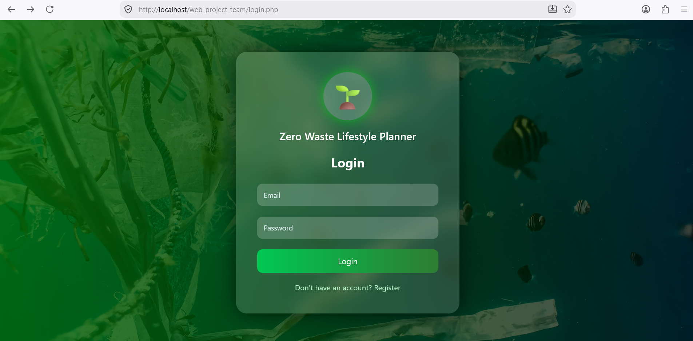
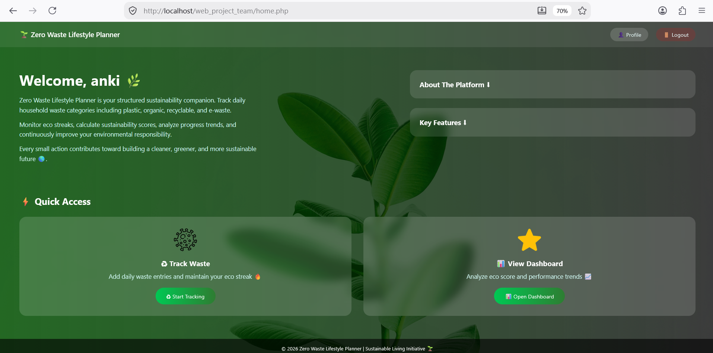
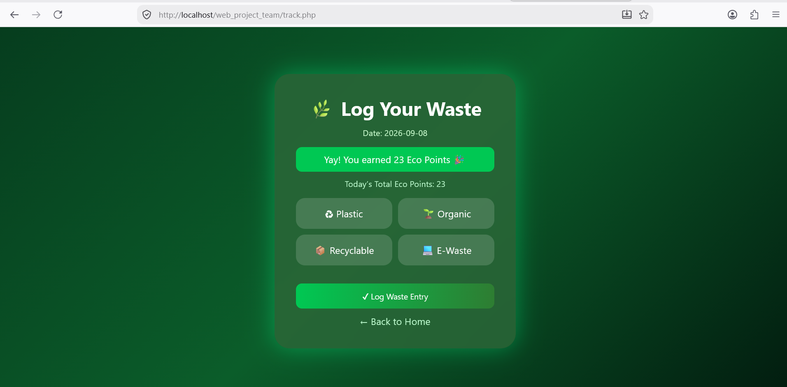
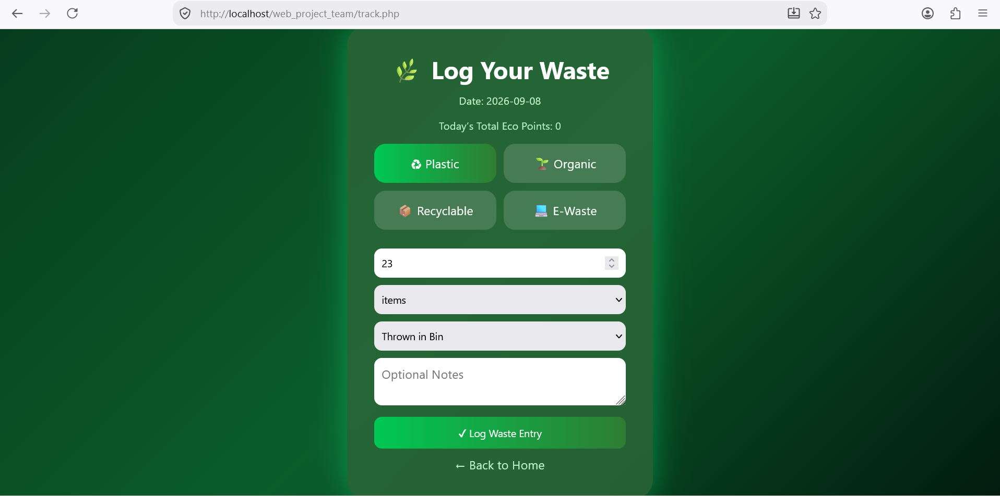
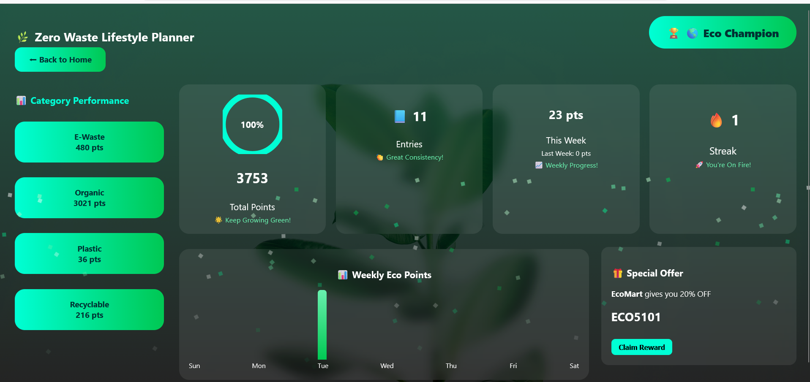
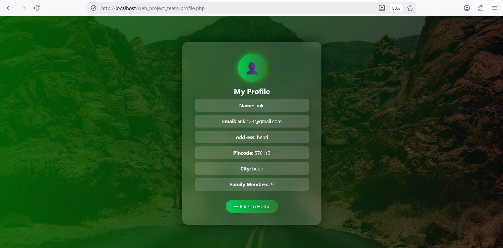

<div align="center">

# 🌱 Zero Waste Lifestyle Planner

**A web-based household waste tracker that turns sustainable habits into a rewarding daily routine.**


</div>

---

## 📖 About the Project

Most people know that reducing waste matters, but very few track *how much* and *what kind* of waste they actually produce. **Zero Waste Lifestyle Planner** closes that gap by giving households a simple place to log daily waste, see their progress, and stay motivated through gamification.

Users can register, log waste by category, earn **Eco Points**, build **daily streaks**, climb **eco levels**, and unlock **reward coupons** – all through a clean, responsive interface.

---

## ✨ Features

| Feature | Description |
|---|---|
| 🔐 **Secure Authentication** | Registration and login with hashed passwords (`password_hash`) and session-based access control |
| ♻️ **Daily Waste Tracking** | Log Plastic, Organic, Recyclable and E-Waste with amount, unit, disposal method and notes |
| ⭐ **Eco Points System** | Points are awarded automatically based on waste type and quantity |
| 🔥 **Streak Tracking** | Consecutive-day logging increases your streak; a skipped day resets it |
| 🏆 **Eco Levels** | Beginner → Eco Saver → Eco Champion based on total points |
| 📊 **Interactive Dashboard** | Total points, entries, weekly chart, last-week comparison, category performance and goal progress ring |
| 🎁 **Reward Coupons** | A prototype coupon is unlocked at 500 points and can be claimed from the dashboard |
| 👤 **User Profile** | View your registered account details |
| 📜 **Waste History** | Review all past waste entries |

### Eco Points Logic

| Waste Type | Points Earned |
|---|---|
| Plastic | 1 × amount |
| Organic | 3 × amount |
| Recyclable | 4 × amount |
| E-Waste | 6 × amount |

### Level System

| Total Points | Level |
|---|---|
| Below 500 | 🌱 Beginner |
| 500 – 1499 | 🌿 Eco Saver |
| 1500 and above | 🌎 Eco Champion |

---

## 📸 Screenshots

### 🔐 Login Page

<p align="center">
  
</p>

---

### 🏠 Home Page

<p align="center">
  
</p>

---

### ♻️ Track Waste

<p align="center">
  
</p>

---

### 📝 Waste Entry Form

<p align="center">
  
</p>

---

### 📊 Dashboard

<p align="center">
  
</p>

---

### 👤 Profile

<p align="center">
  
</p>

## 🛠️ Tech Stack

- **Frontend:** HTML5, CSS3, JavaScript
- **Backend:** PHP
- **Database:** MySQL / MariaDB
- **Local Server:** XAMPP
- **Editor:** Visual Studio Code

---

## 📂 Project Structure

```
Zero-Waste-Lifestyle-Planner/
│
├── db/
│   └── config.php          # Database connection & session start
├── assets/                 # README screenshots
├── dashboard.php           # Analytics dashboard, levels, rewards
├── history.php             # Waste entry history
├── home.php                # Landing page after login
├── login.php               # Login & registration
├── logout.php              # Destroys session
├── profile.php             # User profile
├── track.php               # Waste logging, points & streak logic
└── zero_waste_db.sql       # Database export
```

> **Note:** All pages include the connection file using `include "db/config.php";`, so `config.php` must live inside a folder named `db`.

---

## 🚀 Getting Started

### Prerequisites

- [XAMPP](https://www.apachefriends.org/) (Apache + MySQL + PHP 8.x)
- A modern web browser
- Git (optional, for cloning)

### 1. Download or Clone the Project

**Option A – Clone with Git**

```bash
git clone https://github.com/krithikadevadiga11/Zero-Waste-Lifestyle-Planner.git
```

**Option B – Download ZIP**

1. Open the [repository](https://github.com/krithikadevadiga11/Zero-Waste-Lifestyle-Planner).
2. Click **Code → Download ZIP**.
3. Extract the ZIP file.

### 2. Move the Project to XAMPP

Copy the project folder into the XAMPP web root:

```
C:\xampp\htdocs\Zero-Waste-Lifestyle-Planner
```

### 3. Start the Servers

Open the **XAMPP Control Panel** and start **Apache** and **MySQL**.

### 4. Set Up the Database

1. Open **phpMyAdmin** at `http://localhost/phpmyadmin`.
2. Click **New** and create a database named **`zero_waste_db`**.
3. Select the database, go to the **Import** tab and choose `zero_waste_db.sql`, **or** go to the **SQL** tab and run the queries from the [Database Schema](#-database-schema) section below.

### 5. Configure the Connection

Open `db/config.php` and confirm the credentials match your setup (XAMPP defaults shown):

```php
<?php
$conn = mysqli_connect("localhost", "root", "", "zero_waste_db");

if (!$conn) {
    die("Database connection failed");
}

session_start();
?>
```

### 6. Run the Application

Visit:

```
http://localhost/Zero-Waste-Lifestyle-Planner/login.php
```

Register a new account, log in, and start tracking your waste! 🌿

---

## 🗄️ Database Schema

Database name: **`zero_waste_db`**

```sql
CREATE DATABASE IF NOT EXISTS zero_waste_db;
USE zero_waste_db;

-- Users table
CREATE TABLE `users` (
  `id` int(11) NOT NULL AUTO_INCREMENT,
  `name` varchar(100) NOT NULL,
  `email` varchar(100) NOT NULL,
  `address` text NOT NULL,
  `pincode` varchar(10) NOT NULL,
  `city` varchar(50) NOT NULL,
  `family_members` int(11) NOT NULL,
  `password` varchar(255) NOT NULL,
  `streak` int(11) DEFAULT 0,
  `last_entry` date DEFAULT NULL,
  `eco_score` int(11) DEFAULT 0,
  PRIMARY KEY (`id`),
  UNIQUE KEY `email` (`email`)
) ENGINE=InnoDB DEFAULT CHARSET=utf8mb4 COLLATE=utf8mb4_general_ci;

-- Waste logs table
CREATE TABLE `waste_logs` (
  `id` int(11) NOT NULL AUTO_INCREMENT,
  `user_id` int(11) NOT NULL,
  `waste_type` varchar(50) NOT NULL,
  `amount` decimal(10,2) NOT NULL,
  `unit` varchar(20) NOT NULL,
  `disposal_method` varchar(100) DEFAULT NULL,
  `notes` text DEFAULT NULL,
  `eco_points` int(11) DEFAULT 0,
  `created_at` timestamp NOT NULL DEFAULT current_timestamp(),
  PRIMARY KEY (`id`),
  KEY `user_id` (`user_id`),
  CONSTRAINT `waste_logs_ibfk_1` FOREIGN KEY (`user_id`) REFERENCES `users` (`id`)
) ENGINE=InnoDB DEFAULT CHARSET=utf8mb4 COLLATE=utf8mb4_general_ci;

-- Rewards table
CREATE TABLE `rewards` (
  `id` int(11) NOT NULL AUTO_INCREMENT,
  `user_id` int(11) DEFAULT NULL,
  `coupon_code` varchar(20) DEFAULT NULL,
  `points_required` int(11) DEFAULT NULL,
  `redeemed` tinyint(1) DEFAULT 0,
  PRIMARY KEY (`id`),
  KEY `user_id` (`user_id`),
  CONSTRAINT `rewards_ibfk_1` FOREIGN KEY (`user_id`) REFERENCES `users` (`id`)
) ENGINE=InnoDB DEFAULT CHARSET=utf8mb4 COLLATE=utf8mb4_general_ci;
```

### Table Overview

| Table | Purpose |
|---|---|
| `users` | Account details, streak count and last logged date |
| `waste_logs` | Every waste entry with type, amount, unit, disposal method and earned points |
| `rewards` | Generated coupon codes and their redeemed status |

### Entity Relationship

```
users (1) ────< (many) waste_logs
users (1) ────< (many) rewards
```

---


# 🔄 Application Workflow

```text
             ┌─────────────┐
             │    User     │
             └──────┬──────┘
                    │
                    ▼
          ┌──────────────────┐
          │ Register / Login │
          └────────┬─────────┘
                   │
                   ▼
             ┌──────────┐
             │   Home   │
             └────┬─────┘
                  │
       ┌──────────┼───────────┬──────────┐
       ▼          ▼           ▼          ▼
    Track      Dashboard    History    Profile
       │          │           │
       └──────────┴───────────┘
                  │
                  ▼
           Eco Point / Score
                  │
                  ▼
               Streak
                  │
                  ▼
              Rewards
                  │
                  ▼
               Logout
```

---

1. A new user registers; the password is hashed and stored.
2. After login, a session is created and the user lands on **Home**.
3. In **Track Waste**, the user picks a category, enters details, and earns points.
4. The **streak** is updated on every new day of logging.
5. The **Dashboard** aggregates points, weekly activity, categories and rewards.

## 👥 Team & Contributions

| Member | Role | Contribution |
|---|---|---|
| **Ankitha** | Backend Development | PHP logic, authentication, session handling, waste tracking, Eco Points and streak calculation |
| **Krithika M Devadiga** | Frontend Design | UI/UX design, responsive layouts, styling, animations and page design |
| **Deekshitha** | Database & Rewards Module | MySQL database, table relationships, reward/coupon generation and redemption |
| **Dhrithi P** | Dashboard & Testing | Dashboard analytics, history and profile modules, functional testing and bug fixing |

The project was developed collaboratively, with all team members contributing to the implementation, integration and testing of the application.


# ⚠️ Current Limitations

The current prototype has some limitations:

1. **Manual Data Entry**  
   Users need to manually enter their waste information.

2. **Limited Advanced Analytics**  
   The dashboard currently provides basic monitoring rather than advanced predictive analytics.

3. **Local Deployment**  
   The application is currently designed and tested using a local XAMPP environment.

4. **Prototype Reward System**  
   The coupon feature is a prototype and is not connected to real external reward providers.

5. **No Automatic Waste Measurement**  
   Waste quantity is currently entered manually.

---

# 🔮 Future Scope

## 📡 IoT-Based Waste Tracking

Smart bins equipped with sensors can automatically measure waste quantity and send the information to the application.

This would reduce the need for users to manually enter every waste measurement.

```text
Smart Bin / IoT Sensor
          ↓
    Waste Measurement
          ↓
       Database
          ↓
  Zero Waste Planner
          ↓
 Dashboard / Analytics
```

## 🤖 Smart Waste Classification

Machine learning and computer vision can be used to automatically identify waste categories such as plastic, organic, recyclable and e-waste.

## ☁️ Cloud Deployment

The application can be deployed to a cloud environment so that users can access their data from multiple devices.

## 📊 Advanced Analytics

Future versions can provide:

- Daily waste trends
- Weekly comparisons
- Monthly reports
- Category-wise graphs
- Waste reduction trends
- Personalized sustainability statistics

## 📱 Mobile Application

A dedicated Android or cross-platform mobile application can make waste tracking easier and more accessible.

## 🧠 AI-Based Recommendations

AI can analyze a user's waste history and provide personalized suggestions for:

- Reducing waste
- Improving segregation
- Choosing better disposal methods
- Maintaining sustainable habits

## 🗺️ Recycling Center Locator

A location-based feature can help users find nearby recycling centers and appropriate waste disposal facilities.

## 🔔 Notifications and Reminders

The application can provide:

- Daily waste-entry reminders
- Streak reminders
- Eco Point achievement notifications
- Sustainability tips

## 🎁 Real Eco-Friendly Rewards

The prototype coupon mechanism can eventually be integrated with real eco-friendly businesses and organizations.

---

## 🤝 Contributing

Contributions and suggestions are welcome!

1. Fork the repository
2. Create your feature branch: `git checkout -b feature/YourFeature`
3. Commit your changes: `git commit -m "Add YourFeature"`
4. Push to the branch: `git push origin feature/YourFeature`
5. Open a Pull Request

---

<div align="center">

**Made with 💚 by the Zero Waste Lifestyle Planner team**

*Small actions, tracked daily, build a greener future* 🌎

</div>
